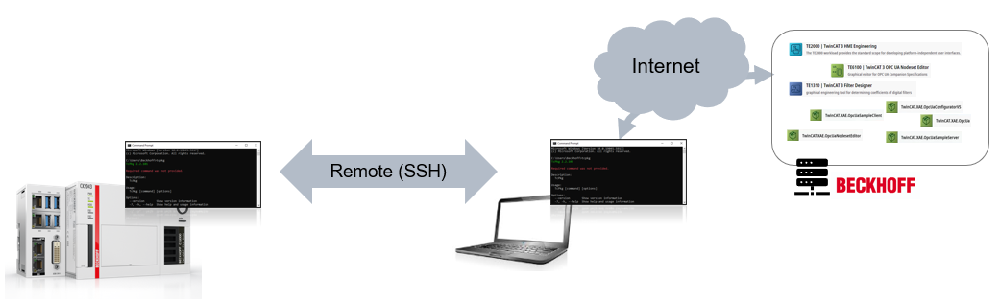

# Common TwinCAT TcPkg Commands

## Disclaimer

This is a personal guide not a peer reviewed journal or a sponsored publication. We make
no representations as to accuracy, completeness, correctness, suitability, or validity of any
information and will not be liable for any errors, omissions, or delays in this information or any
losses injuries, or damages arising from its display or use. All information is provided on an as
is basis. It is the reader’s responsibility to verify their own facts.

The views and opinions expressed in this guide are those of the authors and do not
necessarily reflect the official policy or position of any other agency, organization, employer or
company. Assumptions made in the analysis are not reflective of the position of any entity
other than the author(s) and, since we are critically thinking human beings, these views are
always subject to change, revision, and rethinking at any time. Please do not hold us to them
in perpetuity.

Further commands can be found [here](https://infosys.beckhoff.com/english.php?content=../content/1033/tc3_installation/15698626059.html&id=)
  
## Installation

### Full Migration installation of 4026.x using only CLI

| ⚠️                                                                                                                                                                                                                                                               |
| ---------------------------------------------------------------------------------------------------------------------------------------------------------------------------------------------------------------------------------------------------------------- |
| In most instances the migration of an IPC is possible using the TwinCAT.XAE.MigrateCli. If however this fails then look to re-image the IPC with an OS already configured for 4026. If this is not available, then a fresh install using a blank OS is prefered. |

```bash
################################
#                              #
#  Read the full instructions  #
#    first before starting     #
#                              #
################################

## Install the package manager from the main beckhoff website.

## Once installed, do not open the package manager from the UI.
## Instead follow the instructions below using a CMD window
## with admin rights.

## Add the source replacing YOUR_EMAIL_ADDRESS with your actual myBeckhoff email address.  After pressing enter you will be prompted to enter your password
tcpkg source add -n Stable -s "https://public.tcpkg.beckhoff-cloud.com/api/v1/feeds/stable/" --priority=1 -u "YOUR_EMAIL_ADDRESS"

## Install the migrate tool
tcpkg install TwinCAT.XAE.MigrateCli

################################
#                              #
#    Now close and reopen      #
#         cmd as admin         #
#                              #
################################

## progress with the upgrade
TcMigrateCmd upgrade --whatIf False
```

If you are migrating an IPC and the final step fails with "TwinCAT software, which was not installed via the TwinCAT Package Manager, was found on this system". You can try the same command with the ```--prepCheck``` flag.

```
## replacement step for IPC's showing warning
TcMigrateCmd upgrade --prepCheck --whatIf False
```

If this sill fails, then a new image may be required. 

### Offline installation of 4026 (i.e. no internet connection)

Notes can be found [here...](https://github.com/benhar-dev/tc4026-offline-install)

---

## Uninstallation

### Full Uninstallation of 4026.x

```bash
tcpkg uninstall all
```

### Full Uninstallation of 4024.x

You must first install the migrate tool, then use this to clean the installation. You may need to restart your PC after the first step.

```bash
################################
#                              #
#  Read the full instructions  #
#    first before starting     #
#                              #
################################

## Install the package manager from the main beckhoff website.

## Once installed, do not open the package manager from the UI.
## Instead follow the instructions below using a CMD window
## with admin rights.

## Add the source replacing YOUR_EMAIL_ADDRESS with your actual myBeckhoff email address.  After pressing enter you will be prompted to enter your password
tcpkg source add -n Stable -s "https://public.tcpkg.beckhoff-cloud.com/api/v1/feeds/stable/" --priority=1 -u "YOUR_EMAIL_ADDRESS"

## Install the migrate tool
tcpkg install TwinCAT.XAE.MigrateCli

################################
#                              #
#    Now close and reopen      #
#         cmd as admin         #
#                              #
################################

## progress with the uninstall
TcMigrateCmd.exe clean --whatIf False

## once done, you can restart your pc and uninstall the package manager using add/remove programs
```

### Uninstallation of 4026.x following a failed uninstal / upgrade

There are some instances where every part of 4026 needs to be completley removed following a failed uninstallation or upgrade, which may have left the system in an unknown state.

Copy the code below to a new ```TotalUninstall.bat``` file and execute as administrator. 
```bash
<# : #
@echo off
net session >NUL 2>&1
if '%errorlevel%' NEQ '0' (goto U)else (goto A)
:U
  powershell -nol -nop -ex bypass -c " Start-Process -wai -v RunAs -f cmd -a \"/c \"\" cd /d \"\"%CD% \"\" ^&^& \"\"%~f0\"\" \" "
    exit /B
:A
    pushd "%cd%"
    cd /d "%~dp0"

cd %~dp0 && powershell -nol -nop -ex bypass -c "iex $($PSScriptName='%~nx0';$argsStrg='%argsStrg%';type '%~dpf0' -raw)" && endlocal && goto:eof
#>
try { Stop-Process -Name "TcSysUI" -Recurse -Force } catch { }
$OSArch = (Get-CimInstance -ClassName CIM_OperatingSystem).OSArchitecture
$registryPaths = if ($OSArch -match "64") {
    @(
        "HKLM:\Software\WOW6432Node\Microsoft\Windows\CurrentVersion\Uninstall",
        "HKLM:\Software\Microsoft\Windows\CurrentVersion\Uninstall"
    )
} else {
    @("HKLM:\Software\Microsoft\Windows\CurrentVersion\Uninstall")
}
$installedPackagesReg = @()
foreach ($path in $registryPaths) {
    $packages = Get-ItemProperty "$path\*" | Where-Object {
        (($_.InstallSource -match 'TcPkg') -or ($_.InstallSource -match 'Package Cache') -or ($_.BundleCachePath -match 'Package Cache') -or ($_.SystemComponent -match 1)) -and ($_.Publisher -match 'Beckhoff')
    }
    foreach ($package in $packages) {
        $installedPackagesReg += $package
        if ($package.DisplayName -eq "Beckhoff TwinCAT Prep") {
            $PrepInReg = $true
        }
	if ($package.DisplayName -eq "Beckhoff TwinCAT XAR NdisDriver x64") {
            $NdisInReg = $true
        }
	if ($package.DisplayName -eq "Beckhoff TwinCAT XAR VirtualMp") {
            $MpInReg = $true
        }
    }
}
$installedPackagesData = Get-WmiObject -Class Win32_Product | Where-Object {
    $_.InstallSource -match 'TcPkg'
} | Select-Object IdentifyingNumber, Name, InstallSource
$PrepInDatabase = $installedPackagesData | Where-Object { $_.Name -eq "Beckhoff TwinCAT Prep" }
if (!$PrepInReg -and !$PrepInDatabase) {
    Write-host "No TwinCAT.Prep package found. Please repair/install the package with 'tcpkg repair TwinCAT.Prep' or 'tcpkg install TwinCAT.Prep' in the command line and try again !" -ForegroundColor red
    pause
    exit
}
$NdisInDatabase = $installedPackagesData | Where-Object { $_.Name -eq "Beckhoff TwinCAT XAR NdisDriver x64" }
$MpInDatabase = $installedPackagesData | Where-Object { $_.Name -eq "Beckhoff TwinCAT XAR VirtualMp" }
if ((!$NdisInReg -or !$NdisInDatabase) -and ($MpInReg -or  $MpInDatabase)) {
    Write-host "No TwinCAT.XAR.NdisDriver package found. Please repair/install the package with 'tcpkg repair TwinCAT.XAR.NdisDriver' or 'tcpkg install TwinCAT.XAR.NdisDriver'  in the command line and try again !" -ForegroundColor red
    pause
    exit
}
foreach($package in $installedPackagesReg)
{
    if (($package.DisplayName -ne "Beckhoff TwinCAT Prep") -and ($package.DisplayName -ne "Beckhoff TwinCAT XAR NdisDriver x64")){
        if ($package.QuietUninstallString){
            $UninstallString = "$($package.QuietUninstallString)"
        } else {
            $UninstallString = "$($package.UninstallString -replace '/I', '/X') /qn /norestart" #add REMOVE="ALL"
        }
        $Name = $package.DisplayName
        Write-host "Uninstalling $Name..."
        $processArgs = "/c " + $UninstallString
        Start-Process -FilePath cmd.exe -ArgumentList $processArgs -Wait -NoNewWindow
    }elseif($package.Name -eq "Beckhoff TwinCAT Prep"){
        if ($package.QuietUninstallString){
            $UninstallString = "$($package.QuietUninstallString)"
        } else {
            $UninstallString = "$($package.UninstallString -replace '/I', '/X') /qn /norestart"
        }
        $UninstallPrepRegStr = "/c " + $UninstallString
    }elseif($package.Name -eq "Beckhoff TwinCAT XAR NdisDriver x64"){
        if ($package.QuietUninstallString){
            $UninstallString = "$($package.QuietUninstallString)"
        } else {
            $UninstallString = "$($package.UninstallString -replace '/I', '/X') /qn /norestart"
        }
        $UninstallNdisRegStr = "/c " + $UninstallString
    }
}
$installedPackagesData | ForEach-Object -Process {
    if($_.Name -match "Beckhoff") {
        if(($_.Name -ne  "Beckhoff TwinCAT Prep") -and ($_.Name -ne  "Beckhoff TwinCAT XAR NdisDriver x64")){
            $Name = $_.Name
            $GUID = $_.IdentifyingNumber
            Write-Host "Uninstalling $Name..."
            Start-Process -FilePath msiexec.exe -ArgumentList "/X$GUID /qn /norestart" -Wait -NoNewWindow
        }elseif($_.Name -eq "Beckhoff TwinCAT XAR NdisDriver x64"){
            $UninstallNdisDataGuid = $_.IdentifyingNumber
        }elseif($_.Name -eq "Beckhoff TwinCAT Prep"){
            $UninstallPrepDataGuid = $_.IdentifyingNumber
        }
   }
}
if($NdisInReg){
   Write-Host "Uninstalling Beckhoff TwinCAT XAR NdisDriver x64..."
   try { Start-Process -FilePath cmd.exe -ArgumentList "$UninstallNdisRegStr" -Wait -NoNewWindow } catch { }
   try { Start-Process -FilePath msiexec.exe -ArgumentList "/X$UninstallNdisDataGuid /qn /norestart" -Wait -NoNewWindow } catch { } 
} 
Write-Host "Uninstalling Beckhoff TwinCAT Prep..."
try { Start-Process -FilePath cmd.exe -ArgumentList "$UninstallPrepRegStr" -Wait -NoNewWindow } catch { }
try { Start-Process -FilePath msiexec.exe -ArgumentList "/X$UninstallPrepDataGuid /qn /norestart" -Wait -NoNewWindow } catch { }  
try { Remove-Item "C:\ProgramData\Beckhoff\TcPkg\lib\*" -Recurse -Force } catch { }
write-host "All found Packages are uninstalled"  -ForegroundColor green
pause
```

---

## Working with sources

### List all configured sources

```bash
tcpkg source list
```

### Verify the stable source is available

```bash
tcpkg source verify Stable
```

### Typical Sources

```bash
# "Beckhoff Stable Feed" | all current packages and workloads
tcpkg source add -n Stable -s "https://public.tcpkg.beckhoff-cloud.com/api/v1/feeds/stable/" --priority=1 -u "YOUR_EMAIL_ADDRESS"

# "Beckhoff Outdated Feed" | all outdated versions
tcpkg source add -n Outdated -s "https://public.tcpkg.beckhoff-cloud.com/api/v1/feeds/outdated/" --priority=2 -u "YOUR_EMAIL_ADDRESS"

# "Beckhoff Testing Feed" | Soon to be released packages and workloads (i.e. Beta versions).
tcpkg source add -n Testing -s "https://public.tcpkg.beckhoff-cloud.com/api/v1/feeds/testing/" --priority=3 -u "YOUR_EMAIL_ADDRESS"

# "Beckhoff Preview Feed" | Feature testing feed - Packages that aren’t planned to auto-release like in the Testing feed. (i.e. Preview Beta versions).
tcpkg source add -n Preview -s "https://public.tcpkg.beckhoff-cloud.com/api/v1/feeds/preview/" --priority=4 -u "YOUR_EMAIL_ADDRESS"
```

---

## Working with packages and workloads: Installing, upgrading, and uninstalling

### List all installed packages

```bash
tcpkg list -i
```

### List all of the available workloads on the system

```bash
tcpkg list -t workload
```

### Install a package with a specific version

```bash
tcpkg install TwinCAT.XAE.PLC=3.6.16
```

### Install a package without user intervention

Add the `-y` flag. Can be mixed with other installation options.

```bash
tcpkg install TwinCAT.XAE.PLC -y
```

### Listing dependency of a package

```
tcpkg resolve TwinCAT.Standard.Xae=4026.14 --dependency-tree
```

### Repairing a package

```bash
tcpkg repair twincat.xae.plc
```

### Downgrading a package

```bash
tcpkg upgrade twincat.standard.xae=4026.13.0 --allow-downgrade
```

---

## Tcpkg Configuration

### Set Visual Studio integration

```bash
# Enable a specific Visual Studio or TcXaeShell integration
tcpkg config set -n useVS2022
tcpkg config set -n useTcXaeShell64
```

> ℹ️ After setting, you must install the corresponding integration:
>
> ```bash
> tcpkg install vs2022.ext
> ```

### Remove Visual Studio integration

```bash
# Disable a specific Visual Studio or TcXaeShell integration
tcpkg config unset -n useVS2022
tcpkg config unset -n useTcXaeShell64
```

> ℹ️ After unsetting, you must uninstall the corresponding integration:
>
> ```bash
> tcpkg uninstall vs2022.ext
> ```

### View current configuration

```bash
tcpkg config list
```

Example output:

```
UseVS2017: Not configured
UseVS2019: Not configured
UseVS2022: Not configured
UseTcXaeShell: True
UseTcXaeShell64: True
VerifySignatures: True
```

---

## Fault finding

Use the log file as a primary tool of fault finding. Logs can be found here.

`C:\ProgramData\Beckhoff\TcPkg\logs`

### Adjust logging level

```bash
# verbose
tcpkg config set -n logLevel -v verbose
# information
tcpkg config set -n logLevel -v information
```

If you are looking to fault find TwinCAT.XAE.MigrateCli, then note, the log files for this are stored here.

```C:\ProgramData\Beckhoff\TcMigrateCmd```

---

## Remote control

TcPkg supports controlling a remote instance of TcPkg over SSH, allowing you to relay both commands and package downloads to a connected IPC. This is especially useful when the IPC does not have internet access, but your engineering laptop does.



### Setup our Engineering TcPkg

In the examples below, we’ll refer to the remote IPC as MyIpc.
You can choose any name you like, and register as many remotes as needed.

```bash
# replace 169.254.165.127 with your ipc's ip address
# the --internet-access false will use your engineering computer's internet and feeds for obtaining packages.
tcpkg remote add -n MyIpc --host 169.254.165.127 --port 22 -u Administrator --internet-access false
```

When prompted, enter the Administrator password and accept the SSH fingerprint.

### Installing a Package on the Remote IPC

Once your remote IPC (MyIpc) is registered, you can install TwinCAT packages directly to it using:

```bash
tcpkg install TF8020.BACnet.XAR -r MyIpc
```

What this does:

- Connects to the IPC over SSH.
- Downloads all required packages using the engineering laptop’s internet connection.
- Transfers the packages to the IPC.
- Installs them on the IPC via its local TcPkg.

You’ll be prompted to confirm before installation begins:

```bash
Continue? (Y/N): Y
```

Expected output:

```bash
Package(s) installed:
TF8020.BACnet.XAR 1.0.4
TwinCAT.XAR.BACnet 2.1.6
```

### Troubleshooting a remote connection

TcPkg uses SSH to remote control the second instance. If you are unable to add a remote, then check the following.

#### Check SSH Access via Command Prompt

Open Command Prompt and run:

```bash
# Replace 169.254.165.127 with your target’s IP address.
ssh Administrator@169.254.165.127
```

You’ll be prompted for the Administrator password.

#### Errors Connection Errors

The default password for a Beckhoff IPC is too small to be used for SSH. Therefore you must change your IPC's password first so something secure.

You will be told `Permission denied, please try again.` and `The password does not meet the password policy requirements. Check the minimum password length, password complexity and
password history requirements.` if your password is too short.

---

## Package Management Command Comparison

Here is a comparison of the TwinCAT Package Manager ( tcpkg ) commands alongside their equivalents in FreeBSD ( pkg ) and Debian-based Linux systems ( apt ).

Source: [infosys.beckhoff.com](https://infosys.beckhoff.com/)

| **Function**                        | **TwinCAT (tcpkg)**                                        | **FreeBSD (pkg)**                                                 | **Debian (apt)**                                              |
| ----------------------------------- | ---------------------------------------------------------- | ----------------------------------------------------------------- | ------------------------------------------------------------- |
| **List all available packages**     | `tcpkg list`                                               | `pkg search`                                                      | `apt list`                                                    |
| **List all versions of a package**  | `tcpkg list -a [PackageName]`                              | `pkg search -o [PackageName]`                                     | `apt list -a [PackageName]`                                   |
| **List installed packages**         | `tcpkg list -i`                                            | `pkg info`                                                        | `apt list --installed`                                        |
| **List upgradable packages**        | `tcpkg list -o`                                            | <code>pkg version -v &#124; grep '<' </code>                      | `apt list --upgradable`                                       |
| **Show package details**            | `tcpkg show [PackageName]`                                 | `pkg info [PackageName]`                                          | `apt show [PackageName]`                                      |
| **Install a package**               | `tcpkg install [PackageName]`                              | `pkg install [PackageName]`                                       | `apt install [PackageName]`                                   |
| **Install specific version**        | `tcpkg install [PackageName]=[Version]`                    | Not directly supported; use Ports or specify version if available | `apt install [PackageName]=[Version]`                         |
| **Upgrade a package**               | `tcpkg upgrade [PackageName]`                              | `pkg upgrade [PackageName]`                                       | `apt install --only-upgrade [PackageName]`                    |
| **Upgrade all packages**            | `tcpkg upgrade all`                                        | `pkg upgrade`                                                     | `apt upgrade`                                                 |
| **Uninstall a package**             | `tcpkg uninstall [PackageName]`                            | `pkg delete [PackageName]`                                        | `apt remove [PackageName]`                                    |
| **Uninstall with dependencies**     | `tcpkg uninstall [PackageName] --include-dependencies`     | `pkg delete -R [PackageName]`                                     | `apt autoremove [PackageName]`                                |
| **Add a package source/feed**       | `tcpkg source add --n=[Name] --s=[URL] --priority=[Value]` | `pkg repo` (edit `/etc/pkg/FreeBSD.conf`)                         | Add entry to `/etc/apt/sources.list` or `.list.d/` file       |
| **Edit a package source/feed**      | `tcpkg source edit [Name] --priority=[NewValue]`           | Edit `/etc/pkg/FreeBSD.conf` manually                             | Edit corresponding `.list` file in `/etc/apt/sources.list.d/` |
| **Enable/disable a package source** | `tcpkg source edit [Name] --enabled true/false`            | Edit `/etc/pkg/FreeBSD.conf` manually                             | Use `apt-add-repository` or comment out entries in `.list`    |
| **Set configuration options**       | `tcpkg config set -n [Option]`                             | Not applicable                                                    | Not applicable                                                |
| **Unset configuration options**     | `tcpkg config unset -n [Option]`                           | Not applicable                                                    | Not applicable                                                |

- FreeBSD (pkg): Installing specific versions is not directly supported; use the [Ports Collection](https://docs.freebsd.org/en/books/handbook/ports/) or specify version if available.
- Debian (apt): Specific versions can be installed with apt install [Package]=[Version] , if that version exists in your enabled repositories.
- Package Sources/Feeds: Managing package sources in FreeBSD and Debian typically requires editing config files manually. Debian provides helper tools like
  add-apt-repository to ease the process.

</details>

---


